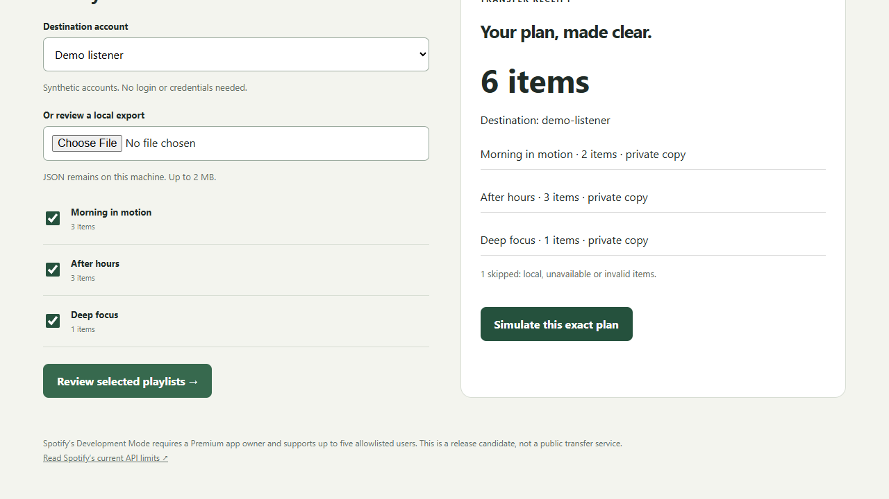

# Playlist Passage

A local, review-first workspace for moving Spotify playlists between your accounts. The new studio lets you select playlists from an export, inspect private-copy plans, see skipped items, simulate the operation and download a receipt. The synthetic demo makes no Spotify changes.

## Run the review studio

Python 3.10+ is sufficient; the studio itself has no third-party dependencies.

```sh
python -m src.studio
```

Open **http://127.0.0.1:4631** or double-click `run-studio.cmd` on Windows. The app binds only to loopback. Choose a synthetic destination, select playlists, review, simulate and download the report. Import JSON from your own export to inspect its contents locally. It remains on your machine; do not upload private exports to issues.



## Read-only Spotify export with PKCE

Install dependencies in an isolated environment:

```sh
python -m venv .venv
.venv/Scripts/python -m pip install -r requirements.txt
.venv/Scripts/python -m src.connect --client-id YOUR_PUBLIC_CLIENT_ID --account YOUR_EXACT_SPOTIFY_ID --output private-export.json
```

Register `http://127.0.0.1:4632/callback` in your Spotify developer application. Browser consent opens automatically. No client secret is required, tokens remain in memory, callback state is validated and the authenticated ID must match `--account`. Consent expires after three minutes. Only owned/collaborative playlists are exported; local and unavailable items are recorded for review. Existing output files are never overwritten. No playlists or liked songs are changed. This live authorization path has been tested with isolated mocked sessions, **not a real Spotify account**.

## What is implemented

- Server-validated selection and content digest; changed review plans require confirmation again.
- Private-copy plans preserving original item order and intentional repeats. Spotify URIs are carried directly between accounts; no fuzzy song substitutions.
- Explicit skip counts for unavailable/local/malformed items.
- Engine batches writes at 100 items, verifies destination before writing, and stops ambiguous failures instead of retrying possibly successful writes.
- Current `/me/playlists` and `/playlists/{id}/items` adapter with bounded rate-limit backoff and separate quota-exhaustion handling.
- Report includes acknowledged counts, created playlist IDs and reconciliation state. An unknown write outcome is not called success.

The studio uses **only an in-memory synthetic backend**. There is no live-write button. The adapter/engine is a tested library candidate for future authenticated transfer integration; no real playlist mutation has been verified. Do not rerun a stopped transfer blindly: inspect the created destination playlist and reconcile its items first. Automatic durable resume, catalog availability verification, covers and liked-song migration are not implemented in the new workflow.

## Current Spotify constraints (checked 2026-10-01)

Development Mode requires a Premium app owner and up to five allowlisted users. Read access to playlist contents is restricted to owned or collaborative playlists. Local files and playlist folders cannot be recreated through the API. Development Mode is intended for personal experimentation, not public-scale deployment. July 2026 increased Client IDs to 25 per developer while pooling quota at developer-account level. API access and extended-quota eligibility must be checked before a public launch.

Primary sources: [February migration guide](https://developer.spotify.com/documentation/web-api/tutorials/february-2026-migration-guide), [July quota update](https://developer.spotify.com/blog/2026-07-23-web-api-quota-updates), [quota modes](https://developer.spotify.com/documentation/web-api/concepts/quota-modes), [PKCE](https://developer.spotify.com/documentation/web-api/tutorials/code-pkce-flow), [playlist limitations](https://developer.spotify.com/documentation/web-api/concepts/playlists).

## Verify and contribute

```sh
python -m unittest discover -s tests -v
```

See [verification](docs/VERIFICATION.md). The original Tkinter utility (`python -m src.main`) remains for compatibility but its old authentication/write endpoints are not migrated or live-verified. Prefer the new read-only exporter and studio. Do not use legacy import/erase for production data. Its timeout retry and partial-pagination behavior have been hardened.

No license file was present in the inspected checkout. Do not assume redistribution rights or claim this project is openly licensed until the owner selects a license. No copyrighted music, album artwork or user account data appears in fixtures or captures.
